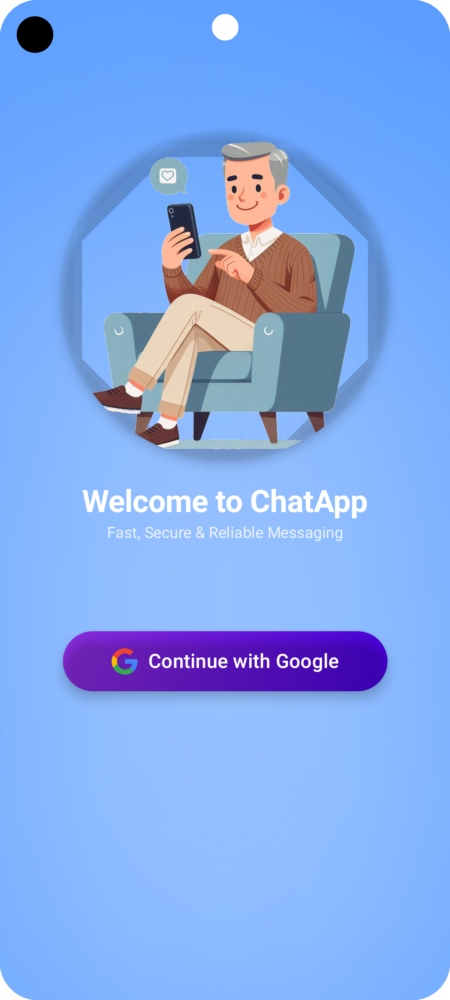

# Real-Time Chat App

  
_A real-time messaging application built using Flutter and Firebase._

## 🚀 Features
- 🔥 Real-time messaging with Firebase Firestore
- 📝 Story posting feature
- 🔔 Push notifications for new messages
- 👥 User authentication (Google & Email login)
- 📸 Media sharing (Images & Videos)
- 🎨 Customizable chat themes
- 🌙 Dark mode support

## 📸 Screenshots
| Home Screen | Chat Screen | Story Feature |
|------------|------------|--------------|
| ! |  |  |

## 🛠️ Tech Stack
- **Frontend:** Flutter (Dart)
- **Backend:** Firebase Firestore, Firebase Authentication
- **Storage:** Firebase Cloud Storage
- **Notifications:** Firebase Cloud Messaging (FCM)

## 🔧 Setup & Installation
1. **Clone the repository**
   ```bash
   git clone https://github.com/Fardhin/Real-Time-ChatApp.git
   ```
2. **Navigate to the project directory**
   ```bash
   cd Real-Time-ChatApp
   ```
3. **Install dependencies**
   ```bash
   flutter pub get
   ```
4. **Set up Firebase**
   - Create a Firebase project.
   - Add Firebase to your Flutter app.
   - Download `google-services.json` (for Android) & `GoogleService-Info.plist` (for iOS) and place them in the respective folders.
5. **Run the app**
   ```bash
   flutter run
   ```

## 📜 License
This project is licensed under the MIT License - see the [LICENSE](LICENSE) file for details.

## 💡 Contributing
Pull requests are welcome. For major changes, please open an issue first to discuss what you would like to change.

## 📬 Contact
📧 **Fardhin Ahamad** - [LinkedIn](https://www.linkedin.com/in/shaik-fardhin-ahamad-2a56b6288/)  
🌐 **GitHub Repository**: [Real-Time-ChatApp](https://github.com/Fardhin/Real-Time-ChatApp)
